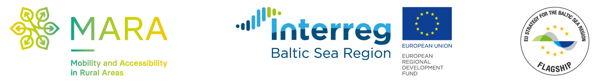

# MARA Project

## Requirements

- "docker" and "make"
- A database dump is expected by the postgis backend service in images/postgis/data.sql (visit https://github.com/WhereGroup/mara-ptm-importer for more information)

## Environments

Referred to as "prod", "staging" and "dev" or {ENV} (variable) in the following text.

## Project Setup

1. Create a symlink from env/host/current to env/host/local (depending on the physical host env/host/mv-net).

```
cd env/host/
ln -s local current
```

2. Setup docker network

```
make create_networks
```

3. Build & run docker images

```
make up_all
```

## Services

The Setup will start 4 service containers:

- **rproxy** - single entrypoint to the application that will distribute incoming requests to backend services.
- **backend** - symfony application offering endpoints to process SQL queries
- **postgis** - PostgreSQL/PostGIS database providing mobility and public transport data
- **client** - apache server used as a static file server serving the optimized mapcomponents/react-app build

## Make docker tooling

All commands are executed in the "dev" environment by default. You can use the "ENV" parameter to target a specific environment (e.g. ```make up_all ENV=prod```).
Exceptions are environment independent targets.


### Preojectwide make targets (defined in "./Makefile"):

- build_all: executes ```docker build``` for all services defined in the project (./images/$(SERVICE_NAME)/Dockerfile)
- run_all
- up_all
- create_networks


### Service specific targets (defined in "./images/_include/skeleton.mk" and can be overridden in "./images/$(SERVICE_NAME)/Makefile"):

- build_$(SERVICE_NAME): Executes ```docker build``` for "./images/$(SERVICE_NAME)/Dockerfile" 
- run_$(SERVICE_NAME):  Executes ```docker run``` for the image created with "make build_$(SERVICE_NAME)"
- up_$(SERVICE_NAME): ```make build_$(SERVICE_NAME) && make run_$(SERVICE_NAME)```
- sh_$(SERVICE_NAME): Interactive Shell-Connection to the service container $(SERVICE_NAME)
- logs_$(SERVICE_NAME):  Show Container logs of $(SERVICE_NAME)

### Variables in service specific makefiles

- Service specific variables: Defined in ./images/{SERVICE_NAME}/Makefile.conf

- Container/environment specific variables: defined in ./env/{ENV}/{SERVICE_NAME}.env

- Host specific variables: defined in ./env/host/current (Symlink see "project setup")

### Generated variables

- FQN: Fully qualified name contains image name and release-tag ```$(IMAGE_NAME):$(VERSION_TAG)```.
- CURRENT_NETWORK: Docker network, of the current service specific target

### Production

Production environment on the host-system (physical server).

### Staging/Test

Staging-/test-environment.

### Development

local development environment

-----

The PTM tool was developed within the framework of the INTERREG Project "[MARA – Mobility and Accessibility in Rural Areas](https://www.mara-mobility.eu/)".



<br /><br /><br />

The Tool (incl. this documentation) was developed by

<a href="https://www.regierung-mv.de/Landesregierung/em"></a>

and

<a href="https://wheregroup.com"></a>